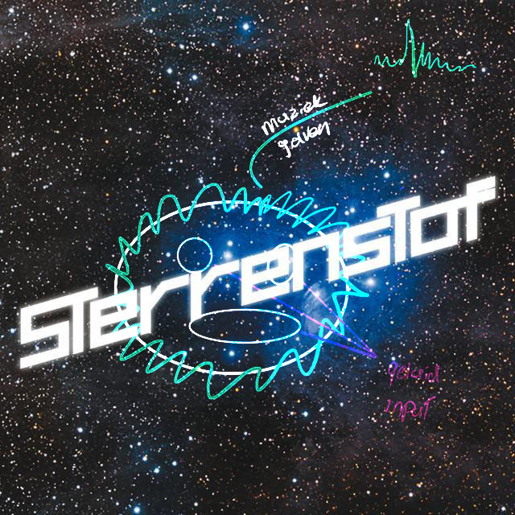

<!-- Vergeet je niet de comments uit te zetten voordat je begint met typen? 💬 -->

# Procesverslag

## Over
* **Naam:** `Joey Yzer`
* **Klas:** `vid-2`
* **Minor:** `Visual Interface Design`
* **Favoriete dier:** `Zeeotters zijn te gek!`
* **Startniveau:** `blauw `

## Concept
`1e concept.`
het bewegen van de muis zorgt ervoor dat er een soort van circuit op het scherm gebrand wordt.

`2e conept`
Een sound visualizer op het nummer sterrenstof. ik wil hier een soort van videoclip van maken waarbij de sterren random mee meebewegen en de gebruiker dmv mic input invloed heeft op het uiterlijk van het beeld. 
De sterren blij ven oneindig doorgaan zoals het voorbeeld hieronder.

## Features

De gebruiker kan met de muziek mee zingen of tikken, dit zorgt ervoor dat de ogen en de mond van de smiley in het beeld groter of kleiner worden. 
## Onderzoek & inspiratie
`Schrijf wat over je onderzoek en je inspiratie voor het project. Hoe kwam je concept tot stand?`

` 1e concept`

` 2e concept`
Voordat ik mijn idee kon uitwerken ben ik eerst gaan zoeken naar verschillende muziek visualisaties die gebruik maakte van P5. Door deze videos te bekijken begreep ik de werking van P5 ietjes meer. Ik heb uiteindlijk verschillende Youtube tutorials bij elkaar gevoegd om tot het eindresultaat te komen.
*  [Colerful coding ](https://www.youtube.com/watch?v=uk96O7N1Yo0&t=818s)
*  [The Coding Train](https://www.youtube.com/watch?v=2O3nm0Nvbi4)
*  [HyperSpace 3D - Youtube](https://www.youtube.com/watch?v=3xHeW-Vxyeg)
*  [Multicolored Lines - Youtube](https://www.youtube.com/watch?v=lRTtMcx6rSM)
*  [Genius - songtekts album cover](https://genius.com/De-jeugd-van-tegenwoordig-sterrenstof-lyrics)

Eerder had ik het idee om doormiddel van de webcam te checken of de gebruiker met zijn hoofd van links naar rechts bewoog op de maat van de muziek om dan op deze manier de input te gebruiken om de achtergrondkleur aan te passen. 
Met onderstaande linkjes heb ik van alles geprobeerd om dit werkend te krijgen. Maar zoals je kan zien is dit helaas niet gelukt.
*  [Tetoki.eu Vida](https://www.tetoki.eu/vida/)
*  [Computer vision - The coding Train](https://www.youtube.com/watch?v=nCVZHROb_dE&t=219s)

## Voortang

### Week-1
Geprobeerd de lijnen van het circuit bord te vizalizeren op het scherm.
Dit is uiteindlijk gelukt zonder een for loop wat dus totaal niet handig is om zo allen lijnen te vizalizeren.

### Week-2
Een ander concept gekozen. Abstracte kunst waarbij een ingelade foto Abstracte gemaakt wordt door de pixels langer of korter te maken. Ik wist niet precies hoe ik nou generative kon maken.
en liep hierdoor dus weer vast.
Dit was het resultaat:
 [Resultaat](https://editor.p5js.org/Yzerrr/sketches/g731NqqJZ)
*  [CImage data - Zhang Weidi](https://www.youtube.com/watch?v=me04ZrTJqWA)

### Week-3
Weer een ander concept.. muziek visualizer met microfoon input voor het nummer Sterrenstof van de Jeugd van tegenwoordig.
Ik wil hierbij de sterren (zie afbeelding hieronder) random op het scherm visualizeren in verschillende grotes en kleuren. Daarbij wil ik de muziekvisualatie in een soort van smiley tonen waarbij de ogen en de mond reageren op geluid.

### Resultaat

<video width="auto" height="240" controls>
  <source src="assets/Screen Recording _V1.mov" type="video/mp4">
</video>
<video width="auto" height="240" controls>
  <source src="assets/Screen Recording _V2.mov" type="video/mp4">
</video>

## Bronnenlijst

*  [p5.org/get-started/](https://p5js.org//get-started/)
*  [Loading sound - The Coding Train](https://www.youtube.com/watch?v=Pn1g1wjxl_0&t=139s)
*  [Colerful Coding](https://www.youtube.com/watch?v=uk96O7N1Yo0&t=818s)
*  [Reading video pixels - Jeff Thompson](https://www.youtube.com/watch?v=VYg-YdGpW1o&t=8s)
*  [Computer vision - The coding Train](https://www.youtube.com/watch?v=nCVZHROb_dE&t=219s)
*  [CImage data - Zhang Weidi](https://www.youtube.com/watch?v=me04ZrTJqWA)
